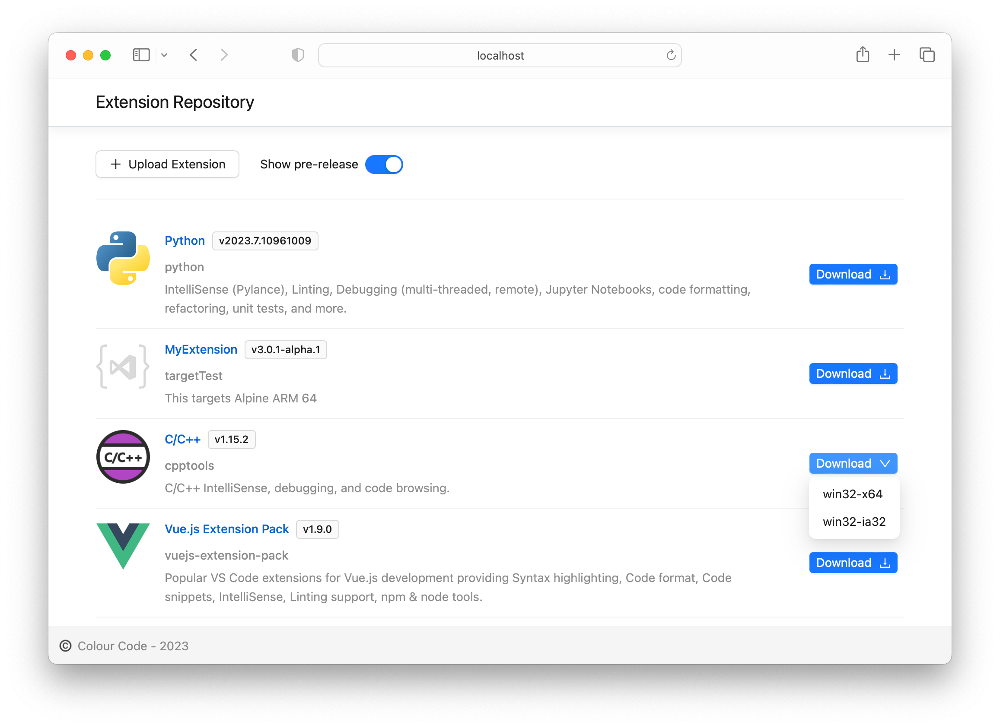

# Private Extension Repository

A lightweight private extension repository for Visual Studio Code. It is self contained, cross-platform and runs on your favorite cloud.
The tool delivers the [feature request in the vscode repository](https://github.com/microsoft/vscode/issues/21839), that is over 6 years old, has over a 1000 thumbs-up, and active even today

## Features

1. **Offline access**: A perfect tool for host extensions internally on your nextwork, especially airtight network environment. Allows teams to test extensions internally before pushing them to the Marketplace
2. **Pre-release support**: The repository supports pre-release versions of extensions, following the Semantic Versioning (SemVer) convention. You can upload pre-release extensions to the repository, and they will be correctly sorted and displayed in the UI.
3. **Multiple instances**: The repository can be easily installed on multiple instances, allowing you to distribute the extensions across your organization. And teams can use the multiple source within the Visual Studio Code
4. **Easy installation and setup**: The application is self contained, it is as easy as running `./extensions-web` from commandline.

With private extension repository, you can ensure that your extensions are secure and managed in a controlled environment. This can be particularly useful for enterprises and teams that need to maintain a certain level of control over the extensions they use